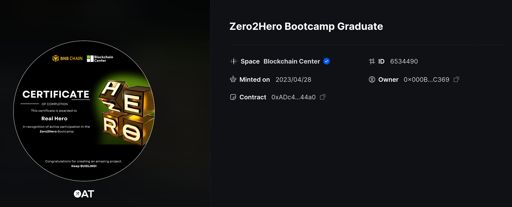
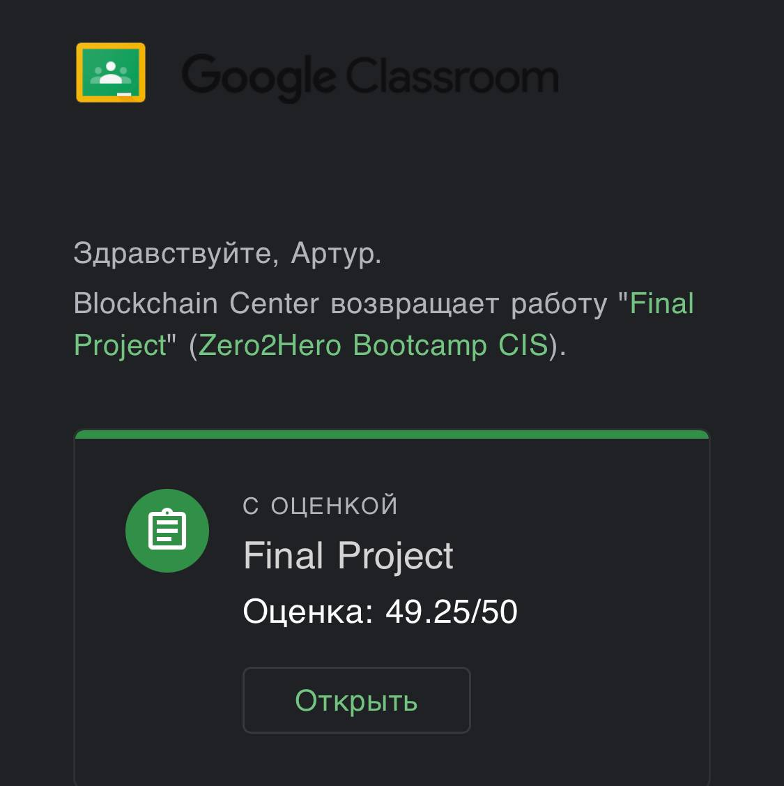
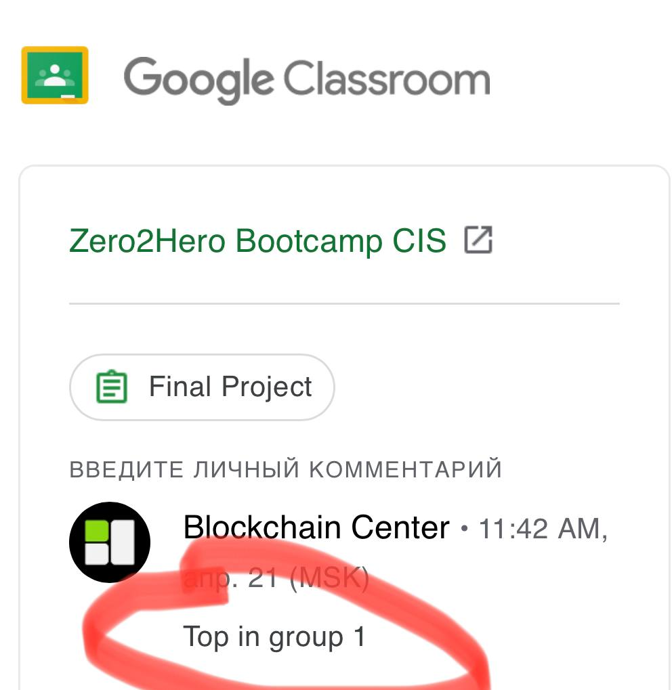
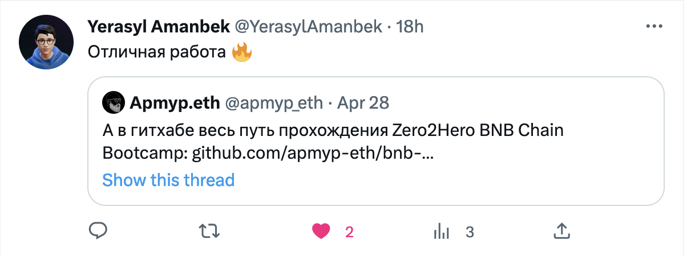

# BNB Zero2Hero Bootcamp (CIS)

~~I'm going through the bootcamp and posting the solved tasks as I progress.~~

## Result

* rating for all assignments 10/10; the final project was handed over with a high score, 1st place in the first group of teams was taken (only two groups, our largest)
* bootcamp [pass certificate](https://galxe.com/nft/6534490/0xADc466855ebe8d1402C5F7e6706Fccc3AEdB44a0)
* same as [NFT-certificate](https://bscscan.com/tx/0xc8f5ff601a524691018093301d3a04f975978e889e4e3c1516692c00201a2de8)
* apmyp.eth address match [proof](https://app.ens.domains/apmyp.eth) in ENS
* [named NFT](https://testnet.bscscan.com/token/0x99742f6dabfb0cf35eee9e7ab6d0d6b86e564ece?a=9) was released [Center of Blockchain](https://twitter.com/cofblockchain) in the testnet

### NFT-certificate

### Evaluation from bootcamp teachers
|  |  |
|---|---|

## Content

### Assignment 1

* [search for a hash with a given number of zeros at the beginning of the hash for a given string + postfix](assignment-01/README.md)

### Assignment 2

* generation of [Merkle tree](assignment-02/merkle-tree/) and verification
* [rock/paper/scissors smart contract game using Chainlink VRF v2](assignment-02/1_RockPaperScissors.sol)
* [smart contract for generating and signing documents with Merkle tree verification, issuing an NFT signature](assignment-02/2_SignDocument.sol)
* [airdrop smart contract with Merkle tree verification](assignment-02/3_Airdrop.sol)
* [voting smart contract with "citizenship" verification by SBT token](assignment-02/4_Ballot.sol)

### Assignment 3

* [rock/paper/scissors frontend game for smart contract from Assignment 2](assignment-03/1_RockPaperScissors_Frontend/README.md)
* [airdrop frontend for smart contract from Assignment 2](assignment-03/2_Airdrop_Frontend/README.md)

### Assignment 4

* [smart contract of NFT collection](assignment-04/1_NFT-Contract/README.md)
* [gallery frontend of NFT collection](assignment-04/2_NFT-Gallery/README.md)
* [smart contract frontend for generating and signing documents from Assignment 2](assignment-04/3_SignDocument/frontend/README.md)

### Assignment 5 - Final project

* [oracle system for supplying financial data to the blockchain](assignment-05_final_project/README.md)
